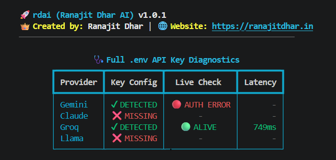

<div align="center">
  <pre>
██████╗ ██████╗  █████╗ ██╗
██╔══██╗██╔══██╗██╔══██╗██║
██████╔╝██║  ██║███████║██║
██╔══██╗██║  ██║██╔══██║██║
██║  ██║██████╔╝██║  ██║██║
╚═╝  ╚═╝╚═════╝ ╚═╝  ╚═╝╚═╝
  </pre>

  <h1>rdai — Multi-Brain AI Orchestrator</h1>
  <p><b>One Python SDK. Any AI Provider. Zero Downtime.</b></p>
  <p>Route requests across Gemini, OpenAI, Groq, Claude and more — with automatic failover, live health checks, and an interactive CLI.</p>

  <p>
    <a href="https://pypi.org/project/rdai/"></a>
    <a href="https://pypi.org/project/rdai/"></a>
    <a href="https://github.com/ranajitdharpersonal/rdai/blob/main/LICENSE"></a>
    <a href="https://pypi.org/project/rdai/"></a>
    <a href="https://github.com/ranajitdharpersonal/rdai/stargazers"></a>
  </p>

  <b>👑 Created by:</b> Ranajit Dhar &nbsp;|&nbsp; 🌐 <a href="https://ranajitdhar.in">ranajitdhar.in</a> &nbsp;|&nbsp; 📦 <a href="https://pypi.org/project/rdai/">PyPI</a> &nbsp;|&nbsp; <b>Version:</b> v1.0.2
</div>

---

## ⚡ The Problem

```
One provider fails (rate limit / crash / timeout)
                ↓
   rdai automatically switches to the next
                ↓
        Your app never goes down
```

`rdai` is a self-healing Python SDK that lets you call multiple AI models — Gemini, OpenAI, Claude, DeepSeek, and more — through **one unified interface**. It auto-discovers your API keys, picks the best provider for your strategy, and silently fails over to a backup the moment something breaks.

---

## 🩺 See it in action — `rdai doctor`

The built-in doctor pings every configured provider live and reports real status, not guesses.

<!-- Crop the screenshot to just the diagnostics table (no terminal chrome/prompt) and drop it here: -->


**Real provider diagnostics — live authentication, reachability, and latency in one command.**

One command tells you exactly which providers are wired up, authenticated, and reachable — before you ship.

---

## 📦 Installation

```bash
pip install rdai
```

## 🚦 Quick Start

```bash
rdai init          # interactive wizard → choose providers, strategy, generate .env + rdai.yaml
# add your API keys to the generated .env file
rdai doctor         # verify every provider is alive
```

```env
GEMINI_API_KEY=your_key_here
GROQ_API_KEY=your_key_here
OPENAI_API_KEY=your_key_here
# add others as selected...
```

**(Your API keys stay strictly local — never hardcoded, never sent anywhere but the provider you're calling.)**

---

## 💻 Python SDK Usage

No need to learn ten different SDKs — `rdai` standardizes everything into one call.

```python
from rdai import AI

ai = AI()  # auto-loads your rdai.yaml strategy

response = ai.generate("Write a multi-agent orchestration script in Python.")
print(response)
# Hello! Here's your answer...
```

If the first model fails, `rdai` silently falls back to the next one in your chain — no extra code required.

---

## 🛠️ Bring Your Own Model (BYOM)

Plug a custom or private API straight into the failover chain:

```python
from rdai.providers.base import BaseProvider
from rdai import AI
import requests

class CustomNexusProvider(BaseProvider):
    def __init__(self, api_key):
        super().__init__(api_key, "nexus-v1")

    def generate(self, prompt: str, **kwargs) -> str:
        res = requests.post(
            "https://api.nexus.com/v1",
            headers={"Key": self.api_key},
            json={"text": prompt},
        )
        return res.json()["reply"]

ai = AI(providers=[CustomNexusProvider(api_key="your_custom_key")])
print(ai.generate("Hello Custom Engine!"))
```

---

## ✨ Why rdai?

| | |
|---|---|
| ✔ **Interactive CLI** | Guided setup wizard, zero config-file hand-editing |
| ✔ **Live Doctor** | Real pings, real latency, real status — not assumptions |
| ✔ **Smart Routing** | Picks the best-fit provider per request |
| ✔ **Automatic Failover** | Rate limits and crashes handled silently |
| ✔ **Provider Agnostic** | 11+ built-in brains, plus BYOM for anything else |
| ✔ **Zero Hardcoding** | Keys stay in your `.env`, never in code |

---

## ⚙️ Routing Strategies & Configuration

`rdai` reads its setup from an optional `rdai.yaml` in your working directory. Environment variables always take precedence over `.env` values.

```yaml
strategy: smart
provider_order:
  - gemini
  - openai
  - groq
```

- **`smart`** — selects the ready provider that best fits the specific request.
- **`manual`** — strictly follows the `provider_order` you define.

> Both strategies keep every other ready provider on standby as automatic fallback for transient rate-limit or timeout failures.

---

## 🎛️ Supported AI Engines

| Provider | Environment Variable | Backend Logic |
| :--- | :--- | :--- |
| **Gemini** | `GEMINI_API_KEY` | Modern `google.genai` SDK |
| **OpenAI** | `OPENAI_API_KEY` | Official `openai` SDK |
| **Groq** | `GROQ_API_KEY` | Official `groq` SDK |
| **VertexAI** | `VERTEXAI_API_KEY` | GCP Project ID via `google.genai` |
| **Claude** | `CLAUDE_API_KEY` | Direct Anthropic REST API |
| **AWS Bedrock** | `AWS_BEDROCK_API_KEY` | AWS `boto3` SDK |
| **DeepSeek** | `DEEPSEEK_API_KEY` | Direct DeepSeek REST API |
| **Qwen** | `QWEN_API_KEY` | Alibaba DashScope REST API |
| **Llama** | `LLAMA_API_KEY` | Universal OpenAI-compatible API |
| **Mistral** | `MISTRAL_API_KEY` | Direct Mistral REST API |
| **HuggingFace** | `HUGGINGFACE_API_KEY` | HF Serverless Inference API |

---

## 🛠️ CLI Command Reference

| Command | Description |
| :--- | :--- |
| `rdai init` | Setup workspace, strategy, and providers |
| `rdai doctor` | Live `.env` scan + API health check |
| `rdai config` | View active routing strategy and failover chain |
| `rdai benchmark` | Run a latency test across active models |
| `rdai health` | Check overall internal system health |
| `rdai about` | Learn about the orchestration architecture |

---

## 🗺️ Roadmap

- ✅ **v1.0.0** — Multi-brain orchestrator core: Unbreakable Auto-Failover, Gemini/OpenAI/Claude/Groq + custom model support, `rdai init` setup wizard, `rdai doctor` live diagnostics
- ✅ **v1.0.1** — Faster dashboard rendering (loading animation removed), expanded PyPI SEO keywords, corrected GitHub project URLs
- ✅ **v1.0.2** — Core architecture unified, missing dependencies resolved, explicit timeouts added for REST providers, and enhanced CLI doctor diagnostics.

- 🟡 **v1.1** — Live streaming: brain activity, frontend events, provider timeline


Full version history: [CHANGELOG.md](https://github.com/ranajitdharpersonal/rdai/blob/main/CHANGELOG.md)

---

## 📂 More Examples

Ready-to-run scripts covering failover, BYOM, and each provider live in [`/examples`](https://github.com/ranajitdharpersonal/rdai/tree/main/examples) — clone the repo and run them directly.

```bash
git clone https://github.com/ranajitdharpersonal/rdai.git
cd rdai/examples
python basic_usage.py
```

---

## 🤝 Contributing

Issues and PRs are welcome — check [open issues](https://github.com/ranajitdharpersonal/rdai/issues) or open a new one to discuss a change before submitting a PR.

If `rdai` saved you from a 3am provider outage, a ⭐ on the repo goes a long way — it's the easiest way to help other developers discover it.

---

<div align="center">
  <i>Built with ❤️ for the next generation of unbreakable AI applications.</i>

  <br /><br />

  <a href="https://github.com/ranajitdharpersonal/rdai">⭐ Star this repo</a> · <a href="https://github.com/ranajitdharpersonal/rdai/issues">Report a bug</a> · <a href="https://pypi.org/project/rdai/">View on PyPI</a>
</div>